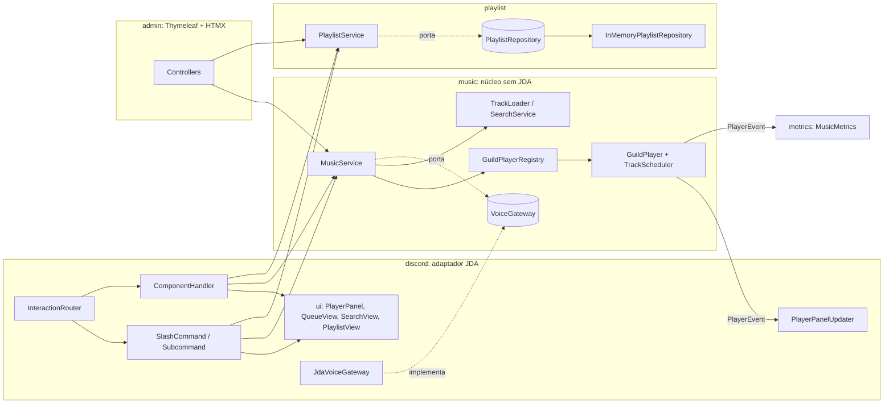

# sabadaco

Bot de música para Discord: toca músicas no canal de voz, tem playlists por usuário, busca, painel de controle no chat e um painel admin web.

**Stack:** Java 25 (LTS) · Spring Boot 4.1 · JDA 6.7 (Components V2 + DAVE via JDAVE) · Lavaplayer 2.2 + youtube-source 1.18 · Micrometer/Prometheus · Thymeleaf + HTMX.

## Como rodar

```bash
export DISCORD_BOT_TOKEN=...          # token do bot
export DISCORD_DEV_GUILD_ID=...       # opcional: registra os comandos só neste servidor (atualiza na hora)
export ADMIN_PASSWORD=...             # senha do painel (sem ela, uma senha temporária aparece no log)
./gradlew bootRun
```

### Com Docker

```bash
cp .env.example .env      # preencha DISCORD_BOT_TOKEN (e, se quiser, DISCORD_DEV_GUILD_ID e ADMIN_PASSWORD)
docker compose up -d --build
docker compose logs -f    # a senha do painel aparece aqui se ADMIN_PASSWORD estiver vazio
```

O painel fica em http://localhost:8080. As playlists estão em memória por enquanto e se perdem ao recriar o container.

### O que é `DISCORD_DEV_GUILD_ID`

É o ID de um servidor (guild) do Discord. Quando definido, o bot registra os comandos **só naquele servidor**, e as mudanças aparecem na hora. É o ideal para testar sem afetar os outros servidores. Vazio, os comandos são **globais** (todos os servidores onde o bot está), que é o uso em produção.

Para pegar o ID: Discord → Configurações de usuário → Avançado → ative o **Modo desenvolvedor**, depois clique com o botão direito no ícone do servidor → **Copiar ID do servidor**.

> Se o bot já tiver comandos globais registrados e você ligar o modo dev, o servidor de teste mostra os dois (globais + do servidor) até os globais serem removidos.

### Sem Discord

Para mexer no painel **sem Discord** (JDA simulado e playlists de exemplo):

```bash
./gradlew bootTestRun   # http://localhost:8080 — usuário admin, senha admin
```

| Variável | Padrão | Para quê |
|---|---|---|
| `DISCORD_BOT_TOKEN` | — | Token do bot (obrigatório) |
| `DISCORD_DEV_GUILD_ID` | vazio | Registro de comandos em um servidor só (dev) |
| `ADMIN_USER` / `ADMIN_PASSWORD` | `admin` / aleatória | Login do painel e basic auth do `/actuator/prometheus` |
| `YOUTUBE_CIPHER_URL` / `YOUTUBE_CIPHER_PASSWORD` | `https://cipher.kikkia.dev/api` | Servidor de cipher do YouTube (recomendado hospedar o seu: [yt-cipher](https://github.com/kikkia/yt-cipher)) |
| `YOUTUBE_OAUTH_ENABLED` / `YOUTUBE_OAUTH_REFRESH_TOKEN` | `false` / vazio | Login no YouTube (client TV) para quando aparecer *"This video requires login"*. **Use uma conta Google descartável.** Passo a passo no `.env.example` |

> A JVM precisa de `--enable-native-access=ALL-UNNAMED` (já configurado no `bootRun`/`test`) por causa do JDAVE.
> O Discord exige o protocolo **DAVE** (E2EE) em toda conexão de voz desde 01/03/2026; sem ele o bot não toca.

## Comandos

Nomes e descrições em inglês, traduzidos automaticamente para quem usa o Discord em pt-BR (`/tocar`, `/buscar`, `/fila`...) via `i18n/commands_pt_BR.properties`. Um teste falha se algum comando, opção ou escolha ficar sem tradução.

| Comando | O que faz |
|---|---|
| `/play <música>` | URL ou nome. O autocomplete sugere suas músicas com apelido (⭐) e resultados do YouTube (🔎), com debounce de 400 ms e cache de 5 min |
| `/search <busca>` | Modo busca: 5 resultados com botão ▶ e select 💾 para salvar em playlist (abre um modal com playlist + apelido) |
| `/player` | Traz o painel do player (capa, progresso, botões ⏯ ⏭ ⏹ 🔀 🔁 🔉 🔊 📜) para o canal |
| `/queue` | Fila paginada, com remover e limpar |
| `/skip` `/stop` `/pause` `/volume` | Controles |
| `/playlist create\|list\|show\|play\|add\|add-current\|alias\|remove\|move\|rename\|delete` | Playlists |
| `/kassino` | 🙂 |

### Regra de prioridade: música avulsa × playlist

A fila tem duas pistas. **Músicas avulsas** (`/play`, busca) sempre tocam antes das **faixas de playlist** que ainda faltam.
O usuário é avisado nos dois sentidos:
- “⚠️ Músicas avulsas têm prioridade: esta toca antes das N músicas restantes da playlist X.”
- “⚠️ … as N avulsas que já estão na fila tocam antes da playlist.”

### Playlists

- Sempre pertencem a um usuário. Escopo **servidor** (padrão: só vale onde foi criada) ou **global** (vale em qualquer servidor).
- Músicas podem ter **apelido** (`/playlist alias`), que aparece no autocomplete do `/play`.
- `/playlist move` move uma música (com o apelido) de uma playlist para outra.

## Arquitetura

> Explicação detalhada de classes, fluxos, concorrência e decisões (por que `synchronized`, virtual threads, `CompletableFuture` etc.): **[docs/ARQUITETURA.md](docs/ARQUITETURA.md)**.



- `music` e `playlist` não conhecem Discord nem web. O Discord e o painel admin são dois adaptadores sobre os mesmos serviços.
- Mudanças no player viram `PlayerEvent` (Spring events). Assim o painel do Discord se atualiza mesmo quando a ação vem do admin, e as métricas não acoplam no núcleo.
- Erros de regra são `UserFacingException`: viram resposta efêmera no Discord e toast no admin.

### Como adicionar um comando

Crie uma classe; nada mais muda (o registro e o roteamento são automáticos):

```java
@Component
@RequiredArgsConstructor
public class NowPlayingCommand implements SlashCommand {
    private final MusicService musicService;

    public SlashCommandData definition() {
        return Commands.slash("nowplaying", "Mostra a música atual");
    }

    public void handle(SlashCommandInteractionEvent event) {
        // ...
    }
}
```

Para um subcomando de um grupo existente, implemente `Subcommand` com `parent() = "playlist"`. Para um grupo novo, crie um `CommandGroup`. Botões e selects usam `ComponentHandler` com customId `prefixo:acao[:payload]`.

### Como trocar o armazenamento das playlists

Implemente `PlaylistRepository` (5 métodos), anote com `@ConditionalOnProperty(name = "sabadaco.storage.type", havingValue = "jpa")` e mude `sabadaco.storage.type` no `application.yml`.

## Métricas (`/actuator/prometheus`)

| Métrica | Tipo | Tags |
|---|---|---|
| `sabadaco.audio.downloaded.bytes` | counter | `source` (youtube/other): bytes baixados das fontes |
| `sabadaco.audio.sent.bytes` | counter | `guild`: bytes Opus enviados ao Discord |
| `sabadaco.track.bytes` | summary | `source`: **bytes por música** (o “KB da música”, também no painel) |
| `sabadaco.track.listened` | timer | `reason` (FINISHED, STOPPED, REPLACED...) |
| `sabadaco.tracks.played` / `sabadaco.tracks.failed` | counter | `source`, `origin` (single/playlist) |
| `sabadaco.players.active`, `sabadaco.queue.size`, `sabadaco.playlists.saved` | gauge | `guild` (fila) |
| `sabadaco.commands` / `sabadaco.components` | timer | `command`/`component`, `outcome` |
| `sabadaco.searches` | counter | `outcome` (found/empty/cached) |

> O download exato por música não é atribuível (o HTTP do Lavaplayer não carrega o contexto da faixa), então o “KB da música” mede os bytes transmitidos, e o download é agregado por fonte.

## Painel admin

`http://localhost:8080/admin`:
- **Servidores:** o que toca em cada servidor, com pausar, pular e parar, atualizando a cada 2s.
- **Servidor:** fila (subir, descer, remover, limpar), volume, loop e embaralhar; tocar uma música ou playlist escolhendo o canal de voz.
- **Playlists:** filtro por pessoa e servidor; criar, renomear e apagar; adicionar, apelidar, remover e mover músicas.

## Testes

```bash
./gradlew test
```
