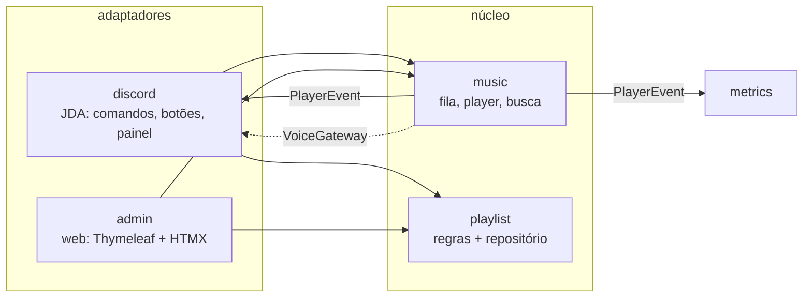
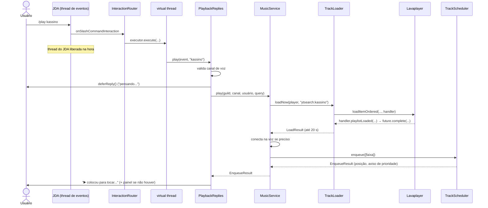
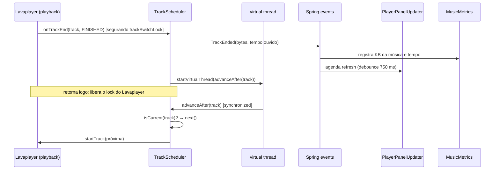
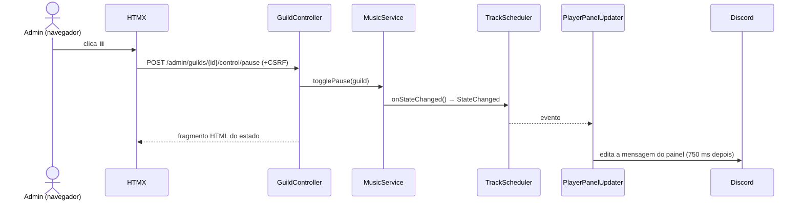
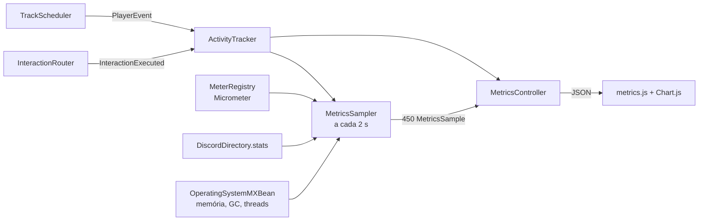

# Sabadaço: arquitetura, código e decisões

Este documento explica **como** o bot funciona e **por que** ele foi feito assim: cada pacote, as classes principais, os fluxos e as decisões técnicas, com as consequências de cada uma. Para rodar o projeto, veja o [README](../README.md).

**Índice**
1. [Visão geral](#1-visão-geral)
2. [Pacotes e classes](#2-pacotes-e-classes)
3. [Fluxos principais](#3-fluxos-principais)
4. [Concorrência: threads, locks e por quê](#4-concorrência-threads-locks-e-por-quê)
5. [Decisões de design](#5-decisões-de-design)
6. [Discord: recursos usados](#6-discord-recursos-usados)
7. [Métricas](#7-métricas)
8. [Painel admin](#8-painel-admin)
9. [Build, runtime e Docker](#9-build-runtime-e-docker)
10. [Testes](#10-testes)
11. [Como estender](#11-como-estender)
12. [Limitações conhecidas](#12-limitações-conhecidas)

---

## 1. Visão geral

O bot tem **um núcleo** e **dois adaptadores**:



Os princípios que guiaram as escolhas:

1. **O núcleo não conhece o Discord nem a web.** `music` e `playlist` não importam JDA nem Spring MVC. Por isso o painel admin consegue pausar uma música usando exatamente o mesmo `MusicService` que o botão do Discord, e os testes do núcleo não precisam de Discord.
2. **Quem precisa do Discord recebe uma porta (interface).** O núcleo precisa conectar no canal de voz, mas isso é coisa do Discord. Ele declara a interface `VoiceGateway`, e o adaptador `JdaVoiceGateway` a implementa.
3. **Mudanças viram eventos.** Quando o player muda, ele publica um `PlayerEvent`. Quem se interessa (painel do Discord, métricas) escuta; o núcleo não sabe quem está ouvindo.
4. **Simplicidade antes de flexibilidade.** Só existe abstração onde há um segundo uso real ou previsto: o repositório de playlists (vai virar banco) e a conexão de voz. O resto é classe concreta.

---

## 2. Pacotes e classes

### `com.gabriellpa.sabadaco` (raiz)

| Classe | Papel |
|---|---|
| `SabadacoApplication` | `main` do Spring Boot. `@EnableScheduling` liga os `@Scheduled` (atualização de progresso do painel). |
| `UserFacingException` | Erro de **regra de negócio** cuja mensagem pode ser mostrada ao usuário ("Entre em um canal de voz primeiro."). Diferencia erro esperado de bug: o Discord responde a mensagem e o admin mostra um toast. Qualquer outra exceção vira "Algo deu errado" e é logada. |

### `music`: o núcleo de música (sem JDA)

| Classe | Papel |
|---|---|
| `MusicService` | **Fachada** usada por Discord e admin: `play`, `playPlaylist`, `resolve`, `togglePause`, `skip`, `stop`, `setVolume`, `cycleLoop`, `shuffle`, operações de fila e `snapshot`. Orquestra loader, registry e voz. |
| `GuildPlayerRegistry` | Um `GuildPlayer` por servidor, criado sob demanda (`computeIfAbsent` num `ConcurrentHashMap`). |
| `GuildPlayer` | O `AudioPlayer` do Lavaplayer + o `TrackScheduler` daquele servidor. `provideFrame()` entrega áudio para o Discord e contabiliza bytes. `tap(...)` entrega uma cópia de cada frame a quem quiser ouvir (admin, veja [8.4](#84-ouvir-pelo-painel)). |
| `TrackScheduler` | **A fila.** Duas pistas (avulsas e playlist), faixa atual, loop, e os listeners do Lavaplayer (`onTrackEnd` etc.). É a classe mais delicada; veja a [seção 4](#4-concorrência-threads-locks-e-por-quê). |
| `TrackLoader` | Converte o callback do Lavaplayer em `CompletableFuture<LoadResult>`. Decide se o texto é URL ou busca (`ytsearch:`). |
| `SearchService` | Busca no YouTube com cache LRU de 5 min. |
| `LoadResult` | `sealed interface` com os 4 resultados possíveis de um carregamento. |
| `QueuedTrack` | Faixa na fila: `AudioTrack` + quem pediu + nome da playlist (ou `null` se avulsa). |
| `TrackSummary`, `QueueEntry`, `PlayerSnapshot`, `EnqueueResult` | **Records imutáveis** com dados para fora do núcleo (UI, admin, playlists). Não carregam objetos do Lavaplayer. |
| `LoopMode` | `OFF → TRACK → QUEUE`, com `next()` para o botão que cicla. |
| `VoiceGateway` | **Porta** de conexão de voz (implementada no pacote `discord`). |
| `event.PlayerEvent` | `sealed interface` com `TrackStarted`, `TrackEnded`, `TrackFailed`, `StateChanged`, `Stopped`. |
| `lavaplayer.PlayerConfiguration` | Cria o `AudioPlayerManager`: registra o YouTube primeiro, os demais sources depois, e liga o contador de bytes baixados. |
| `lavaplayer.YoutubeProperties` | Config do servidor de cipher do YouTube. |

### `playlist`: regras de playlist

| Classe | Papel |
|---|---|
| `Playlist` | Record: id, dono, escopo, servidor, nome, faixas. Métodos `with...` devolvem **cópias** (imutável). |
| `PlaylistTrack` | Record: uri, título, autor, duração, **apelido**. Só tipos simples, fácil de persistir. |
| `PlaylistScope` | `GUILD` (padrão, só no servidor) ou `GLOBAL` (todos os servidores do usuário). |
| `PlaylistRepository` | **Porta** de persistência com 5 métodos. |
| `InMemoryPlaylistRepository` | Implementação em `ConcurrentHashMap`, ativa quando `sabadaco.storage.type=memory`. |
| `PlaylistService` | Regras: nome único por (dono, escopo, servidor), visibilidade, dono obrigatório para alterar, limites, mover faixa entre playlists. |

### `discord`: adaptador JDA

| Classe | Papel |
|---|---|
| `DiscordConfiguration` | Cria o `JDA`: intents mínimos, cache de voz, **DAVE** via `JDaveSessionFactory`, registra os listeners. |
| `DiscordProperties` | `discord.token`, `discord.dev-guild-id`. |
| `JdaVoiceGateway` | Implementa `VoiceGateway`: abre a conexão de voz e pluga o `AudioPlayerSendHandler`. |
| `AudioPlayerSendHandler` | Ponte Lavaplayer → JDA: o JDA pede um frame Opus a cada 20 ms. |
| `DiscordDirectory` | Nomes de servidores, canais e usuários para o admin (usuários são lembrados quando interagem). |
| `interaction.InteractionExecuted` | Evento publicado pelo `InteractionRouter` ao fim de cada comando/componente (usuário, nome, resultado, duração), usado pelas estatísticas do admin. |
| `interaction.*` | O "framework" de comandos (veja [5.1](#51-comandos-por-interface-e-não-por-anotação--reflexão)). Inclui `CommandHelp` (a ajuda que cada comando declara) e `HelpCatalog` (junta a ajuda de todos para o `/help`, veja [5.14](#514-help-montado-a-partir-dos-próprios-comandos)). |
| `command.*` | Um comando por classe (inclui `HelpCommand`, o `/help`). `PlaybackReplies` concentra o fluxo "tocar + responder + garantir painel". |
| `command.playlist.*` | Os 11 subcomandos de `/playlist`, cada um em sua classe, com base comum `PlaylistSubcommand` e opções/autocomplete em `PlaylistOptions`. |
| `component.*` | Handlers de botões, selects e modais (`PlayerButtons`, `QueueComponents`, `SearchComponents`, `PlaylistComponents`, `HelpComponents`). |
| `ui.*` | Montagem das mensagens Components V2 (`PlayerPanel`, `QueueView`, `SearchView`, `PlaylistView`, `HelpView`), textos (`EnqueueMessages`, `Format`, `Messages`) e o `PlayerPanelUpdater`. |

### `admin`: painel web

| Classe | Papel |
|---|---|
| `SecurityConfiguration` | Login por formulário (painel) + basic auth (Prometheus). Usuário em memória vindo do ambiente. |
| `DashboardController`, `GuildController`, `PlaylistAdminController` | Telas e ações. |
| `AdminViews` | Monta os dados das telas e expõe helpers de formatação para o Thymeleaf (`@views.duration(...)`). |
| `PlayerControls` | Ações de player compartilhadas pelas telas. |
| `AdminErrorHandler` | `UserFacingException` → toast (HTMX) ou mensagem flash (redirect). |
| `MetricsController` | Página `/admin/metrics` e API JSON `/admin/api/metrics?since=` (histórico incremental + resumo). Veja [8.3](#83-aba-métricas-de-onde-vêm-os-números). |
| `listen.ListenController` | `GET /admin/guilds/{id}/listen`: stream Ogg/Opus do que o bot toca ([8.4](#84-ouvir-pelo-painel)). |
| `listen.OggOpusWriter` | Empacota frames Opus em páginas Ogg (RFC 3533/7845), sem recodificar. |

### `metrics`

| Classe | Papel |
|---|---|
| `MusicMetrics` | Escuta `PlayerEvent` e registra contadores, timers e gauges. |
| `CountingHttpEntity` | Conta os bytes lidos das respostas HTTP do Lavaplayer (download). |
| `ActivityTracker` | Usuários ativos, rankings (músicas, comandos, usuários), plays avulsa × playlist e o `Timer` de latência com p50/p95/p99 (janela móvel de 2 min). |
| `MetricsSampler` | A cada 2 s tira uma `MetricsSample` (taxas calculadas a partir dos contadores acumulados) e guarda 15 min em memória. |
| `MetricsSample` | Record com uma foto das métricas, consumido pelos gráficos. |

---

## 3. Fluxos principais

### 3.1 `/play kassino`



Pontos importantes:
- O `InteractionRouter` **não executa o comando na thread do JDA**: manda para uma virtual thread. Assim o comando pode bloquear (carregar música leva ~1 s) sem travar os outros eventos do bot.
- O Discord exige uma resposta em **até 3 s**. Carregar pode demorar mais, então o comando faz `deferReply()` primeiro ("o bot está pensando...") e responde depois pelo `hook`.
- A validação do canal de voz vem **antes** do `deferReply()`. Assim o erro "entre em um canal de voz" sai **efêmero** (só para quem chamou), em vez de substituir o "pensando..." público.

### 3.2 Fim de uma música



O avanço é **assíncrono** de propósito; a explicação completa está em [4.3](#43-o-deadlock-que-foi-evitado).

### 3.3 Admin pausa → painel do Discord atualiza



Nenhuma linha do admin sabe que existe um painel no Discord: o evento faz a ponte.

---

## 4. Concorrência: threads, locks e por quê

### 4.1 Quem roda onde

| Thread | O que faz | Pode bloquear? |
|---|---|---|
| **Eventos do JDA** | Entrega eventos do gateway (comandos, botões) | **Não**: travar aqui atrasa todo o bot. Por isso o router repassa tudo. |
| **Virtual threads do router** | Executam comandos e componentes | Sim, é para isso que existem |
| **Playback do Lavaplayer** (1 por faixa tocando) | Decodifica o áudio e dispara `onTrackStart`/`onTrackEnd` | Não deveria: segura locks internos (veja 4.3) |
| **Envio de áudio do JDA** (1 por conexão de voz) | Chama `canProvide()` / `provide20MsAudio()` a cada 20 ms | **Nunca**: um atraso aqui vira áudio picotado |
| **`panel-updater`** (virtual, agendada) | Edita a mensagem do painel com debounce | Sim |
| **Tomcat** (virtuais, com `spring.threads.virtual.enabled`) | Requisições do painel admin | Sim |

### 4.2 Por que `synchronized` no `TrackScheduler`

O estado da fila não é **uma** coisa, são várias que precisam mudar **juntas**:

```java
private final List<QueuedTrack> priorityLane = new ArrayList<>();
private final List<QueuedTrack> playlistLane = new ArrayList<>();
private QueuedTrack current;
private LoopMode loopMode = LoopMode.OFF;
```

Exemplo: `skip()` lê `loopMode`, talvez reinsere `current` no fim de uma pista, tira o primeiro de outra pista e troca `current`. Se outra thread fizer `enqueue` no meio, a posição calculada, o aviso de prioridade ou a própria ordem podem sair errados.

**Por que não `ConcurrentLinkedQueue` ou outra coleção concorrente?** Ela só garante que **cada operação isolada** é segura. Aqui as operações são **compostas** (ler 3 campos e alterar 2 de forma consistente), e coleções concorrentes não resolvem isso. Precisaríamos de um lock de qualquer jeito.

**Por que `synchronized` e não `ReentrantLock`?**
- Ele é **reentrante**: `onTrackStuck` → `skip()` → `startOrIdle()` → `start()` podem se chamar dentro do mesmo lock sem travar a própria thread.
- É o mais simples de ler, e desde o Java 24 (JEP 491) **não "prende" virtual threads** no carrier ao bloquear. A desvantagem histórica sumiu no Java 25.
- Não precisamos de `tryLock`, timeout ou várias condições, que é quando o `ReentrantLock` vale a pena.

**Consequência:** as operações de um servidor são serializadas. Isso é ótimo: um servidor nunca tem duas mudanças de fila ao mesmo tempo. Servidores diferentes têm schedulers diferentes, então **um não espera o outro**.

**E por que os bytes usam `AtomicLong` em vez do lock?**

```java
/** Chamado pela thread de áudio a cada frame enviado ao Discord (~50x por segundo). */
public void recordSentBytes(int bytes) {
    currentTrackBytes.addAndGet(bytes);
    totalBytesSent.addAndGet(bytes);
}
```

Esse método roda na **thread de envio de áudio**, 50 vezes por segundo. Se ele precisasse do lock do scheduler, bastaria um `enqueue` de playlist grande para atrasar um frame, e o áudio picotaria. Um contador é **um único valor independente**, então `AtomicLong` (operação atômica de CPU, sem lock) basta.

Regra geral usada no projeto: **lock para estado composto, atômico para contador isolado**.

### 4.3 O deadlock que foi evitado

O Lavaplayer chama `onTrackEnd` **segurando o lock interno dele** (`trackSwitchLock`). No código do `DefaultAudioPlayer`:

```java
private void handleTerminator(InternalAudioTrack track) {
    synchronized (trackSwitchLock) {              // 🔒1 Lavaplayer
        dispatchEvent(new TrackEndEvent(...));    // → chama nosso onTrackEnd
    }
}
```

A primeira versão fazia:

```java
public void onTrackEnd(...) {        // já dentro de 🔒1
    if (endReason.mayStartNext) {
        next();                      // synchronized → quer 🔒2 (scheduler)
    }
}

public synchronized void skip() {    // segura 🔒2
    ... player.startTrack(...);      // quer 🔒1
}
```

Duas threads pegando os mesmos locks em **ordem inversa** é a receita clássica de deadlock. Se a música acabasse no exato momento em que alguém clicasse ⏭, as duas threads esperariam para sempre: aquele servidor ficaria mudo e todo comando nele travaria.

**A correção:**

```java
public void onTrackEnd(AudioPlayer player, AudioTrack track, AudioTrackEndReason endReason) {
    events.accept(new PlayerEvent.TrackEnded(...));
    if (endReason.mayStartNext) {
        Thread.startVirtualThread(() -> advanceAfter(track));   // fora do 🔒1
    }
}

synchronized void advanceAfter(AudioTrack ended) {
    if (isCurrent(ended)) {   // alguém já trocou de faixa? então não faz nada
        next();
    }
}
```

- **Por que virtual thread aqui?** Criar uma custa quase nada (é um objeto, não uma thread do SO). O listener retorna em microssegundos e libera o lock do Lavaplayer.
- **Por que o `isCurrent`?** Com o avanço assíncrono surge outra corrida: a música acaba (avanço agendado) e, antes dele rodar, alguém dá skip (já foi para a próxima). Sem a guarda, o avanço atrasado pularia **mais uma** música. A guarda compara a **instância** da faixa (`==`), não o título, porque a mesma música pode estar duas vezes na fila.
- **Consequência:** entre o fim de uma faixa e o começo da próxima passam alguns microssegundos a mais. É imperceptível.
- Coberto pelos testes `trackEndCountsBytesAndAdvancesAsynchronously` e `lateEndOfAnAlreadySkippedTrackDoesNotSkipAgain`.

### 4.4 Virtual threads no `InteractionRouter`

```java
private final ExecutorService executor = Executors.newVirtualThreadPerTaskExecutor();

public void onSlashCommandInteraction(SlashCommandInteractionEvent event) {
    ...
    executor.execute(() -> run(event, ...));
}
```

**Por quê:**
- Comandos fazem I/O bloqueante: carregar do YouTube, buscar, esperar `CompletableFuture`. Na thread de eventos do JDA isso atrasaria **todos** os outros eventos do bot.
- Com virtual threads o código pode ser **sequencial e simples** (`var result = musicService.play(...)`), sem cadeias de `thenApply`/`thenCompose`. Quando a virtual thread bloqueia, ela solta o carrier, e milhares podem esperar ao mesmo tempo quase sem custo.
- **Alternativa descartada:** um pool fixo (`newFixedThreadPool(8)`). Ele limita a concorrência artificialmente: 8 buscas lentas travariam o 9º comando.

**Consequência:** cada handler **precisa** responder ou fazer `deferReply()` em até 3 s (regra do Discord). Quem pode demorar faz `deferReply()` logo no começo.

### 4.5 `CompletableFuture` e `future.complete(...)` no `TrackLoader`

O Lavaplayer tem API de **callback**: você passa um handler e ele chama um dos 4 métodos quando terminar, em outra thread.

```java
public CompletableFuture<LoadResult> load(Object orderingKey, String query) {
    var future = new CompletableFuture<LoadResult>();
    audioPlayerManager.loadItemOrdered(orderingKey, toIdentifier(query), new AudioLoadResultHandler() {
        public void trackLoaded(AudioTrack track) {
            future.complete(new LoadResult.TrackLoaded(track));
        }
        public void playlistLoaded(AudioPlaylist playlist) { future.complete(new LoadResult.PlaylistLoaded(...)); }
        public void noMatches() { future.complete(new LoadResult.NoMatches()); }
        public void loadFailed(FriendlyException e) { future.complete(new LoadResult.Failed(e.getMessage())); }
    });
    return future;
}
```

**Por que transformar callback em future:**
- `future.complete(x)` **"preenche"** o future com o valor; quem estiver esperando (`get`) acorda. É a ponte padrão entre "me avise quando terminar" e "me devolva um valor".
- Com o future, quem chama decide **como** esperar: bloquear com timeout (`loadNow`, ideal em virtual thread) ou disparar vários em paralelo.
- `playPlaylist` usa isso para carregar **todas as faixas em paralelo** e depois esperar cada uma, mantendo a ordem:
  ```java
  var futures = uris.stream().map(uri -> trackLoader.load(new Object(), uri)).toList();   // dispara todos
  for (int i = 0; i < futures.size(); i++) {
      if (TrackLoader.await(futures.get(i), uris.get(i)) instanceof LoadResult.TrackLoaded loaded) { ... }
  }
  ```
  Uma playlist de 30 músicas leva o tempo da mais lenta, e não a soma das 30.
- **Por que `complete` com um `LoadResult` em vez de `completeExceptionally`?** "Não achou" e "falhou" são **resultados esperados**, não exceções. Um `sealed interface` obriga quem usa a tratar os 4 casos (o `switch` não compila se faltar um).
- **Timeout de 20 s:** sem ele, um carregamento travado prenderia a virtual thread e o usuário ficaria no "pensando..." para sempre. No timeout vira `Failed`.

**`loadItemOrdered` e a `orderingKey`:** loads com a **mesma chave** são resolvidos na ordem em que foram pedidos. Para `/play` a chave é o player do servidor: duas pessoas dando `/play` quase juntas entram na fila na ordem certa. Para busca e playlist usamos `new Object()` (chave única), porque ali ordem não importa e queremos paralelismo.

### 4.6 Debounce do painel

```java
if (hasPanel(guildId) && pendingRefresh.add(guildId)) {
    scheduler.schedule(() -> { pendingRefresh.remove(guildId); refresh(guildId); }, 750, MILLISECONDS);
}
```

Uma troca de música gera vários eventos em sequência (`TrackEnded`, `TrackStarted`, `StateChanged`). Editar a mensagem 3 vezes em 1 ms desperdiça o **rate limit** do Discord (há limite de edições por canal). O `Set` garante **um** refresh agendado por servidor; os eventos que chegam nesse intervalo "pegam carona". `ConcurrentHashMap.newKeySet()` porque eventos chegam de várias threads.

Além disso, um `@Scheduled` a cada 15 s atualiza a barra de progresso de quem está tocando. É um meio-termo entre "barra viva" e não abusar da API.

### 4.7 Debounce do autocomplete do `/play`

O Discord envia **um** autocomplete por tecla. Sem controle, digitar "kassino" faria 5 buscas no YouTube.

```java
private boolean isLatestAfterPause(long userId) {
    long keystroke = keystrokes.merge(userId, 1L, Long::sum);   // "sou a tecla nº N"
    Thread.sleep(DEBOUNCE);                                      // espera 400 ms
    return keystrokes.get(userId) == keystroke;                  // ninguém digitou depois?
}
```

- `Thread.sleep` só é aceitável porque estamos numa **virtual thread**; numa thread de plataforma seria desperdício.
- Pedidos "atropelados" respondem só com os apelidos (rápido). O Discord **descarta** respostas de pedidos substituídos, então o usuário não percebe.
- `ConcurrentHashMap.merge` incrementa de forma atômica: duas teclas quase simultâneas recebem números diferentes.
- Junto disso o `SearchService` tem um cache LRU de 5 min (seção 5.10).

---

## 5. Decisões de design

### 5.1 Comandos por interface, e não por anotação + reflexão

A versão original tinha `@SlashCommand(name=..., options=...)` em métodos, descobertos por reflexão.

| | Interfaces (escolhido) | Anotações + reflexão |
|---|---|---|
| Definição | Builder nativo do JDA: autocomplete, choices, min/max, localização e contexts vêm de graça | Cada recurso do Discord precisa ser remodelado como anotação |
| Erros | Na **compilação** | Em **runtime** (nº de argumentos, opção com nome errado) |
| Testes | Instancia a classe e chama `handle` | Precisa do registry |
| AOT/GraalVM | Sem reflexão | Precisa de hints |

```java
public interface SlashCommand extends CommandHandler {
    SlashCommandData definition();                    // builder do JDA
}
public interface Subcommand extends CommandHandler {
    String parent();                                  // "playlist"
    SubcommandData definition();
}
```

A ideia boa do design original, **subcomandos espalhados em classes diferentes**, foi mantida com `Subcommand.parent()`. Anotação vale a pena quando há **dezenas** de comandos muito parecidos e se quer *binding* automático de parâmetros (estilo `@RequestParam` do Spring MVC). Não é o caso aqui.

**Consequência:** para criar um comando basta uma classe `@Component`. O Spring injeta todas as implementações (`List<SlashCommand>`) no router e no registrar.

### 5.2 Registro em lote (`updateCommands`)

O Discord diz: *criar um comando com o mesmo nome de um existente **sobrescreve** o antigo*. O código original fazia um `upsertCommand("music")` **por subcomando**, então só o último sobrevivia. O `CommandRegistrar` agora agrupa tudo e faz **um** `updateCommands().addCommands(...)` (*bulk overwrite*): o Discord fica exatamente igual ao código, e comandos removidos somem.

### 5.3 Um único `InteractionRouter`

Todo evento de interação passa por um só lugar, que:
- acha o handler (`getFullCommandName()` → `"playlist move"`; customId → prefixo);
- roda numa virtual thread;
- **mede** o tempo (`sabadaco.commands`, com `outcome`);
- **trata erros**: `UserFacingException` vira resposta efêmera; o resto é logado e o usuário recebe uma mensagem genérica;
- lembra o nome do usuário para o admin.

Sem ele, cada comando repetiria try/catch, métricas e despacho. Handlers duplicados derrubam o boot (`IllegalStateException`): melhor falhar cedo que ter um comando "fantasma".

### 5.4 customId `prefixo:acao:payload`

```java
var parts = id.split(":", 3);   // limite 3!
```

O payload pode ser uma URL (`search:play:https://youtu.be/x`), que tem `:`. Com `split(":")` a URL seria cortada; com limite 3 tudo depois do segundo `:` fica inteiro no payload. O Discord limita o customId a 100 caracteres, por isso `SearchView` ignora URIs com mais de 80.

### 5.5 Duas pistas na fila (regra de prioridade)

Alternativas consideradas:
- **Uma fila só, inserindo avulsas "antes da playlist":** exigiria marcar e procurar posições a cada inserção; mover, remover e embaralhar ficam confusos.
- **Duas listas (escolhido):** `next = priority.poll() ?? playlist.poll()`. A regra está na estrutura, não em cálculos.

`move` entre pistas é proibido de propósito: arrastar uma avulsa para dentro da playlist quebraria a regra. `EnqueueResult` devolve os números (`skippedPlaylistTracks`, `singlesAhead`) e quem monta o **texto** do aviso é a UI (`EnqueueMessages`); o núcleo não decide idioma nem formatação.

### 5.6 Records imutáveis e snapshots

`PlayerSnapshot`, `QueueEntry`, `TrackSummary`, `Playlist` e `PlaylistTrack` são `record`s.
- **Thread-safety de graça:** o snapshot é tirado **dentro** do lock e depois circula livremente (UI, admin, gauges) sem risco de ver a fila "pela metade".
- `Playlist.withTracks(...)` cria uma cópia. O repositório sempre recebe um objeto novo e ninguém altera uma playlist "por baixo" de outro.
- `List.copyOf` no construtor compacto de `Playlist` garante que a lista interna não seja modificável por fora.

### 5.7 `PlayerEvent` como `sealed interface` + Spring events

```java
public sealed interface PlayerEvent {
    record TrackStarted(long guildId, QueuedTrack track) implements PlayerEvent {}
    ...
}
```

- `sealed` + `switch` com pattern matching: o compilador **obriga** o `MusicMetrics` a tratar todos os tipos. Um evento novo não fica esquecido em silêncio.
- Spring events (`ApplicationEventPublisher`) evitam que o núcleo dependa de quem escuta. Hoje são o painel e as métricas; amanhã pode ser um log de auditoria, sem tocar no núcleo.
- **Cuidado:** os listeners rodam **na thread que publicou** (às vezes a thread do Lavaplayer, segurando lock). Por isso nenhum listener faz trabalho pesado: o painel só **agenda** a atualização, e as métricas só incrementam contadores.

### 5.8 `@Lazy JDA` (ciclo de dependências)

```
JDA ← listeners (InteractionRouter) ← comandos ← MusicService ← VoiceGateway (JdaVoiceGateway) ← JDA
```

O JDA precisa dos listeners para ser criado, e o `JdaVoiceGateway` precisa do JDA. O `@Lazy` injeta um **proxy**: o JDA real só é buscado no primeiro uso (quando alguém dá `/play`), e aí ele já existe. A alternativa seria registrar os listeners depois de criar o JDA, mas então haveria o risco de o `ReadyEvent` chegar antes dos listeners estarem registrados.

### 5.9 Playlists: escopo, ids no autocomplete, índice base 1

- **Escopo:** a playlist é **sempre** do usuário. `GUILD` vale só onde foi criada (padrão); `GLOBAL` vale em qualquer servidor. "Visíveis" = do servidor atual + globais.
- O autocomplete mostra o **nome** e envia o **id**. Assim "Rock" do servidor e "Rock" global não se confundem. Quem digita o nome sem escolher também funciona (`PlaylistOptions.find` tenta id, depois nome).
- O usuário vê músicas numeradas a partir de **1**, e o código usa índice **0**. A conversão fica num só lugar (`PlaylistOptions.trackIndex`).
- Mover uma música leva o apelido junto: é a mesma `PlaylistTrack`.
- `synchronized` nos métodos de escrita do `PlaylistService`: cada operação é "ler a playlist, alterar, salvar". Sem lock, duas alterações simultâneas poderiam perder uma delas (*lost update*). Com banco de dados isso vira transação ou versão otimista.

### 5.10 Cache de busca (LRU + TTL)

```java
new LinkedHashMap<>(16, 0.75f, true) {          // true = ordem de ACESSO
    protected boolean removeEldestEntry(...) { return size() > 200; }
};
```

- `LinkedHashMap` com ordem de acesso + `removeEldestEntry` é um **LRU** em poucas linhas, sem biblioteca extra.
- TTL de 5 min: resultados do YouTube mudam pouco, e o cache cobre o padrão "apaga uma letra, digita de novo".
- Resultados **vazios não são cacheados**, para que uma falha temporária não fique "presa".
- `Clock` injetável: o teste avança o relógio 6 minutos sem esperar.
- `synchronized (cache)`: `LinkedHashMap` não é thread-safe e até um `get` altera a ordem interna.

### 5.11 Repositório trocável sem complexidade

```java
@Repository
@ConditionalOnProperty(name = "sabadaco.storage.type", havingValue = "memory", matchIfMissing = true)
public class InMemoryPlaylistRepository implements PlaylistRepository { ... }
```

Para usar um banco basta outra classe com `havingValue = "jpa"` e mudar a propriedade. O `PlaylistService` não muda. A interface tem só os **5 métodos necessários**; filtros mais elaborados ficam no serviço até haver volume que justifique consultas no banco.

### 5.12 `UserFacingException` e não códigos de erro

Regras são validadas onde fazem sentido (serviço, scheduler) e lançam `UserFacingException("mensagem amigável")`. O router (Discord) e o `AdminErrorHandler` (web) convertem em resposta. **Consequência:** nenhum handler precisa de try/catch, e a mesma regra gera a mesma mensagem nos dois canais.

### 5.13 Normalização de URL do YouTube (remoção do `https://`)

O código original removia `https://` de URLs do YouTube. Testado com Lavaplayer 2.2.7 + youtube-source 1.18.2: o `DefaultAudioPlayerManager` tenta os sources **na ordem de registro** e para no primeiro que reconhece; o YouTube é registrado primeiro e sua regex aceita `https://`. A remoção deixou de ser necessária. Pior: sem o esquema (`www.youtube.com/...`), o texto acabava virando **busca**. Hoje: URL passa direto; texto livre vira `ytsearch:`.

### 5.14 `/help` montado a partir dos próprios comandos

O `/help` lista todos os comandos por categoria e mostra exemplos de cada um. Em vez de manter um texto de ajuda separado (que envelhece), **cada comando descreve a si mesmo**:

```java
public interface CommandHandler {
    void handle(SlashCommandInteractionEvent event);
    CommandHelp help();     // obrigatório
    ...
}

@Override
public CommandHelp help() {
    return CommandHelp.of(Category.MUSIC, "Toca uma música pelo nome ou pela URL do YouTube.",
            List.of(example("/play kasino sabadaço gilberto barros", "Busca e toca.")),
            "Sem nada tocando a música começa na hora.");
}
```

- **`help()` é obrigatório** em `CommandHandler` (e portanto em `SlashCommand` e `Subcommand`), sem método `default`. Um comando novo sem ajuda **não compila**, então nenhum comando fica de fora do `/help`. É a mesma ideia de "erro na compilação" da [5.1](#51-comandos-por-interface-e-não-por-anotação--reflexão).
- **`CommandHelp`** é um record imutável: categoria (`MUSIC`, `CONTROLS`, `PLAYLIST`, `OTHER`), resumo de uma linha, exemplos (comando + explicação) e dicas.
- **`HelpCatalog`** junta o que os comandos declaram: nome, descrição (do `definition()`), a ajuda e o **nome em português**, lido do mesmo `commands_pt_BR.properties` usado na localização (sem tradução, vale o nome em inglês). `find` aceita o nome em inglês ou em português, com ou sem `/` (`play`, `tocar`, `playlist move`, `playlist mover`).
- **Por que `ObjectProvider` e não `List<SlashCommand>`?** O próprio `HelpCommand` é um `SlashCommand`. Pedir a lista no construtor do `HelpCatalog` criaria um ciclo (o catálogo dependeria do help, que depende do catálogo). Com `ObjectProvider` a lista só é resolvida quando o `/help` é usado, quando todos os beans já existem.
- **Telas** (`HelpView`, Components V2, sempre efêmeras): a visão geral agrupa por categoria e traz um select `🔍 Ver exemplos de um comando…`; o detalhe traz exemplos em blocos de código e dicas, com o botão `◀️ Todos os comandos`. `HelpComponents` trata o select e o botão **editando a mesma mensagem**, em vez de mandar outra. `/help command:<nome>` (`/ajuda comando:<nome>`) tem autocomplete e vai direto ao detalhe; nome inexistente vira `UserFacingException` (resposta efêmera).
- O select do Discord aceita **no máximo 25 opções**; hoje são 21 comandos e subcomandos. Passando disso, será preciso paginar.
- **Teste:** `HelpCatalogTest` garante que todos os comandos e subcomandos têm resumo e exemplos, e que cada exemplo começa com o próprio nome do comando.

---

## 6. Discord: recursos usados

| Recurso | Onde | Por quê |
|---|---|---|
| **DAVE** (E2EE de voz) via JDAVE | `DiscordConfiguration` | Obrigatório desde 01/03/2026; sem ele o áudio não funciona |
| **Components V2** (`Container`, `Section`, `Thumbnail`, `TextDisplay`, `Separator`) | `ui.*` | Layout rico (capa + texto + botões) sem embeds |
| **Modal com `Label` + select** | `SearchComponents` | Escolher playlist e apelido num só passo |
| **Autocomplete** | `/play`, `/playlist` | Busca enquanto digita; escolher playlist/música pelo nome |
| **Localização** (`LocalizationFunction`) | `CommandRegistrar` + `i18n/commands_pt_BR.properties` | `/tocar` para quem usa o Discord em português |
| **Interaction contexts** (`GUILD`) | `CommandRegistrar` | Comandos não aparecem em DM, onde não fazem sentido |
| **Respostas efêmeras** | erros, listas, busca | Não poluir o canal |
| **Allowed mentions vazias** | `Messages` | Exibir `@usuário` sem **notificar** ninguém |

Detalhe da localização: o JDA monta as chaves a partir dos nomes (`playlist.create.options.scope.description`). Nas **escolhas**, o nome vira minúsculo com `_` no lugar de espaço (`choices.this_server_only.name`). O teste `everyDescriptionAndChoiceHasPortugueseTranslation` falha se algo ficar sem tradução.

---

## 7. Métricas

| Métrica | Como é medida | Por que assim |
|---|---|---|
| `sabadaco.audio.downloaded.bytes` | `CountingHttpEntity` envolve a resposta HTTP e conta cada `read()` | Mede o tráfego **real** baixado |
| `sabadaco.audio.sent.bytes` | `FunctionCounter` lendo `TrackScheduler.totalBytesSent()` | Não cria objeto a cada frame (50/s); o Micrometer lê o valor só quando alguém coleta |
| `sabadaco.track.bytes` | Bytes enviados entre `TrackStarted` e `TrackEnded` | É o **"KB da música"** |
| `sabadaco.track.listened` | Timer com `reason` | Mostra se as pessoas pulam muito (`REPLACED`) ou ouvem até o fim (`FINISHED`) |
| `sabadaco.commands` / `.components` | Timer no router | Tempo e taxa de erro por comando |
| `sabadaco.searches` | Contador com `found`/`empty`/`cached` | Eficiência do cache |
| Gauges (`players.active`, `queue.size`, `playlists.saved`) | Funções lidas sob demanda | Estado atual, sem manter contadores em paralelo |

Além dessas, o `ActivityTracker` registra `sabadaco.interactions.latency` (um `Timer` sem tags, com p50/p95/p99 numa janela móvel de 2 min), usado pela aba Métricas do admin ([8.3](#83-aba-métricas-de-onde-vêm-os-números)).

Duas limitações conscientes:
- **Download por música não é exato:** o HTTP do Lavaplayer não sabe de qual faixa é cada requisição. Por isso o "KB da música" usa os bytes **transmitidos**, e o download é agregado por fonte.
- **O YouTube source não implementa `HttpConfigurable`**, então `setHttpBuilderConfigurator` não o alcança. O contador é ligado direto em `youtube.getHttpInterfaceManager()`, o que foi descoberto lendo o código-fonte.

---

## 8. Painel admin

### 8.1 Telas e HTMX

- **Thymeleaf + HTMX** em vez de um SPA: um deploy só, sem build de frontend. O HTMX troca **pedaços** da página (`hx-post` → fragmento HTML), dando sensação de app. JavaScript próprio só onde HTMX não serve: tema, player de escuta (`static/js/admin.js`) e a aba de gráficos (`static/js/metrics.js`).
- **Polling a cada 2 s** (`hx-trigger="every 2s"`) em vez de WebSocket/SSE: mais simples, sem estado de conexão, e suficiente para um painel com poucos usuários. A aba de métricas segue a mesma ideia (consulta a API JSON a cada 2 s).
- **CSRF:** o token vai numa `<meta>`, e um listener `htmx:configRequest` (em `admin.js`) o coloca em toda requisição HTMX. Os formulários com `th:action` recebem o campo automaticamente.
- **Erros:** `AdminErrorHandler` responde com cabeçalhos `HX-Retarget: #toast` e `HX-Reswap: innerHTML`: a mensagem aparece no toast em vez de substituir o conteúdo. Fora do HTMX, vira mensagem *flash* e volta para a página anterior, aceitando só caminhos `/admin` para evitar *open redirect*.
- **Playlists usam POST + redirect (PRG):** recarregar a página não reenvia o formulário.
- **Segurança:** form login para o navegador, basic auth para o Prometheus. Sem `ADMIN_PASSWORD`, uma senha aleatória é gerada e logada, nunca uma senha padrão fixa.
- O admin age **em nome do dono** da playlist (`owner(id)`), reaproveitando as mesmas regras do `PlaylistService`.

### 8.2 Visual: temas, barra lateral e animações

- **Telas** em `templates/admin/` (`fragments`, `dashboard`, `guild`, `playlists`, `playlist`, `metrics`) e estilos em `static/css/admin.css`. Todas usam os mesmos fragmentos (`head`, `sidebar`, `flash`, `listenBar`); a barra lateral vira barra superior abaixo de ~860 px.
- **Temas:** "creme" (claro, bege bem clarinho) e escuro, definidos como **variáveis CSS** (tokens de cor). A escolha do botão **Tema** fica no `localStorage` (`sabadaco-theme`); um script mínimo no `<head>` a aplica **antes de pintar**, para a página não piscar no tema errado. Sem escolha salva, vale `prefers-color-scheme`. O JS dispara o evento `themechange`, e os gráficos releem as cores na hora.
- **Animações** (entrada das páginas, hover dos cartões, indicador das abas com mola, pop-in dos painéis, KPIs contando com *easeOutBack*, barras nascendo) ficam todas atrás de `prefers-reduced-motion`: quem pede menos movimento não vê nenhuma.
- Fonte Inter (Google Fonts) e Chart.js (cdnjs) vêm de CDN **para o navegador**; o servidor não depende de internet para isso, mas o navegador do admin sim para ver os gráficos.

### 8.3 Aba Métricas: de onde vêm os números



| Peça | Papel |
|---|---|
| `InteractionExecuted` | Evento (record) que o `InteractionRouter` publica ao fim de **cada** comando ou componente: `userId`, `name`, `component`, `outcome` (`success`, `user_error`, `error`) e `durationNanos`. Desacopla o router das estatísticas, na mesma linha do `PlayerEvent`. |
| `ActivityTracker` | Escuta `InteractionExecuted` e `PlayerEvent.TrackStarted`. Guarda **usuários ativos** (último momento visto), rankings (top músicas, comandos, usuários), plays avulsa × playlist e um `Timer` global `sabadaco.interactions.latency` com percentis p50/p95/p99 numa **janela móvel de 2 min**. O mapa de músicas é limitado (2000 títulos) para não crescer sem fim. |
| `MetricsSampler` | `@Scheduled` a cada 2 s tira uma `MetricsSample` e guarda as últimas **450 (15 min)** num `Deque`. Os contadores do Micrometer são **acumulados**; o sampler guarda os totais da foto anterior e grava a **diferença** (taxa): KB/s enviados e baixados, músicas iniciadas, comandos e erros (por nome), latência média/p95/p99, mais CPU do processo e da máquina (`OperatingSystemMXBean`), heap/não-heap, threads de plataforma, pausas de GC, servidores tocando, fila, ouvintes em voz, usuários ativos (5 min), buscas e buscas do cache, conexões de voz e ping do gateway. |
| `MetricsSample` | Record imutável com uma foto. Valores "por intervalo" já são deltas; o resto é o valor no instante `t`. |
| `DiscordDirectory.stats()` | Servidores, conexões de voz, ouvintes (pessoas nos canais com o bot, sem contar bots) e ping do gateway. |
| `MetricsController` | `GET /admin/metrics` (a página) e `GET /admin/api/metrics?since=<t>`: o histórico **incremental** (só as fotos com `t > since`) mais um **resumo** atual (totais, rankings, playlists por escopo, tempo no ar). |
| `static/js/metrics.js` | Busca a API a cada 2 s, mantém as fotos em memória, desenha com Chart.js. Toda a aba nasce da constante `GROUPS`. |

Decisões:
- **Histórico no servidor, em memória:** a página abre já preenchida (até 15 min) e a coleta continua com a aba fechada ou pausada. Não substitui o Prometheus: para histórico longo, alertas e retenção use o `/actuator/prometheus` com Grafana. Reiniciar o bot zera o histórico.
- **Taxas calculadas no sampler, não no navegador:** o navegador recebe números prontos e não precisa lembrar do total anterior (nem se perde se você recarregar).
- **JSON incremental (`since`)** evita reenviar 15 min de dados a cada 2 s; só o resumo (pequeno) vai inteiro.
- **Percentis numa janela móvel** (`distributionStatisticExpiry`): p95 e p99 refletem os últimos 2 min, não o tempo de vida do processo, que esconderia um problema recente.
- **Evento em vez de o router chamar o tracker:** o router não conhece estatísticas; se amanhã houver um log de auditoria, é só outro `@EventListener`.
- **Visualização** (regras seguidas no `metrics.js`): cores categóricas em ordem fixa e **por entidade** (a cor de um comando nunca troca de lugar), validadas para daltonismo e contraste nos dois temas; um eixo Y por gráfico; legenda sempre visível com o valor atual (linhas) ou o total da janela (barras); barras agrupadas em no máximo 30 colunas em janelas longas; e um botão **Tabela** em cada gráfico como alternativa acessível.

### 8.4 Ouvir pelo painel

O painel pode transmitir ao navegador **o mesmo áudio que o bot envia ao Discord**.

```mermaid
sequenceDiagram
  participant D as Thread de envio do JDA
  participant GP as GuildPlayer
  participant Q as ArrayBlockingQueue (250)
  participant L as ListenController<br/>(virtual thread do Tomcat)
  participant B as Navegador (&lt;audio&gt;)

  B->>L: GET /admin/guilds/{id}/listen
  L->>GP: tap(queue::offer)
  L-->>B: cabeçalhos Ogg (OpusHead, OpusTags)
  loop a cada 20 ms
    D->>GP: provideFrame()
    GP->>Q: cópia do frame Opus (offer, instantâneo)
    L->>Q: poll(1 s)
    L-->>B: página Ogg (1 pacote)
  end
```

- **`GuildPlayer.tap(Consumer<byte[]>)`** registra um consumidor que recebe uma **cópia de cada frame Opus** que vai ao Discord. Devolve um `AutoCloseable` (try-with-resources remove o tap ao fim da requisição). O consumidor roda na **thread de áudio** (50×/s, a regra do [4.2](#42-por-que-synchronized-no-trackscheduler)): por isso é só `queue::offer`, que nunca bloqueia.
- **Fila limitada de ~5 s (250 frames):** se o navegador atrasar e a fila encher, `keepLatest` descarta o frame **mais antigo** e enfileira o novo. Assim o ouvinte continua "ao vivo" (no máximo ~5 s de atraso) em vez de ficar cada vez mais para trás. A operação nunca bloqueia, então um ouvinte lento **nunca** trava o áudio do Discord.
- **`OggOpusWriter`** empacota os frames em Ogg (RFC 3533 / 7845): `OpusHead`, `OpusTags`, **um pacote por página**, *granule position* +960 por frame de 20 ms (48 kHz) e CRC do Ogg. Validado com ffmpeg (250 frames viram 5,00 s, Opus 48 kHz estéreo, sem erros) e coberto por `OggOpusWriterTest`. O Opus do Lavaplayer já está pronto, então **não há recodificação**.
- **Escrita síncrona na resposta**, numa virtual thread do Tomcat (`spring.threads.virtual.enabled`): bloquear esperando frames custa quase nada e **não esbarra no timeout de requisições assíncronas** do Spring MVC (que cortaria um `StreamingResponseBody` longo). Encerra após 120 s sem áudio e quando o navegador desconecta (`IOException`).
- **Só existe áudio quando o bot toca num canal de voz:** o `provideFrame()` só roda quando o Discord pede um frame. Sem player no servidor, o endpoint responde `404`; sem música, o botão **Ouvir** nem aparece na UI.
- **UI:** a barra flutuante inferior (`listenBar`) fica **fora** das áreas atualizadas pelo HTMX, para o polling de 2 s não derrubar o `<audio>`. O volume é local (`audio.volume`) e não mexe no volume do bot. A cada clique o `src` ganha um `?t=` novo para o navegador não reaproveitar um stream antigo.

---

## 9. Build, runtime e Docker

- **Java 25 (LTS)** é exigido pelo JDAVE (API de FFM para código nativo), por isso `--enable-native-access=ALL-UNNAMED` em `bootRun`, `test` e no `ENTRYPOINT`.
- `opus-java` excluído do JDA: o Lavaplayer já entrega áudio em Opus.
- `spring-boot-configuration-processor` como `annotationProcessor`, já que só é usado na compilação.
- **Dockerfile multi-stage:** compila com JDK e roda com JRE (imagem menor). Baseado em **Ubuntu e não Alpine**, porque os binários nativos do JDAVE precisam de glibc. Roda como usuário sem privilégios.
- **`bootTestRun`:** sobe o app com o JDA **simulado** (Mockito) e playlists de exemplo, para mexer no painel sem token.

---

## 10. Testes

| Teste | O que garante |
|---|---|
| `TrackSchedulerTest` | Prioridade entre pistas, loop, remover/mover, bytes, avanço assíncrono e a guarda contra pulo duplo |
| `PlaylistServiceTest` | Escopos, visibilidade, nome único, mover com apelido, só o dono altera |
| `SearchServiceTest` | Cache, expiração e não-cache de vazio |
| `InteractionRouterTest` | Despacho por nome e prefixo, erro amigável, `:` no payload, duplicados |
| `CommandRegistrarTest` | Todos os comandos registrados, subcomandos agrupados, guild-only, **tradução completa** |
| `HelpCatalogTest` | Todo comando e subcomando tem resumo e exemplos, e os exemplos começam com o nome do próprio comando |
| `AdminPanelTest` | Telas renderizam de verdade (Thymeleaf), login, CSRF, toast |
| `OggOpusWriterTest` | Cabeçalhos Ogg/Opus, uma página por pacote, CRC e *granule position* corretos |
| `SabadacoApplicationTests` | O contexto Spring inteiro sobe (JDA mockado) |

Os testes do núcleo não sobem Spring nem Discord: são classes simples com mocks do Lavaplayer, o que só é possível porque o núcleo não depende do JDA.

---

## 11. Como estender

**Novo comando:**
```java
@Component
@RequiredArgsConstructor
public class NowPlayingCommand implements SlashCommand {
    private final MusicService musicService;

    public SlashCommandData definition() {
        return Commands.slash("nowplaying", "Shows the current song");
    }

    public void handle(SlashCommandInteractionEvent event) { ... }

    public CommandHelp help() {
        return CommandHelp.of(Category.MUSIC, "Mostra a música que está tocando.",
                List.of(example("/nowplaying", "Mostra título, autor e progresso.")));
    }
}
```
Além da classe, três coisas são obrigatórias, e as duas últimas têm teste que avisa:
1. **`help()`**: sem ele o código não compila. Dê um resumo, exemplos que começam com o próprio comando (`HelpCatalogTest` confere) e, se quiser, dicas. O `/help` passa a listar o comando sozinho.
2. Adicione `nowplaying.name` e `nowplaying.description` em `commands_pt_BR.properties` (o `CommandRegistrarTest` avisa se esquecer).
3. Se o comando tiver uma categoria nova, acrescente-a em `CommandHelp.Category`.

**Novo botão:** implemente `ComponentHandler` com um `prefix()` novo e use `CustomId.of(prefixo, acao, payload)` ao criar o botão.

**Novo armazenamento:** implemente `PlaylistRepository` com `@ConditionalOnProperty(..., havingValue = "jpa")`.

**Novo gráfico na aba Métricas:**
1. **Dado novo?** Se o valor ainda não existe na `MetricsSample`, acrescente um campo no record e preencha-o em `MetricsSampler.toSample` (para contadores acumulados, grave a diferença para a foto anterior, como os demais). Se for um total ou ranking, ponha no `Summary` do `MetricsController`.
2. **Declare o gráfico** em `static/js/metrics.js`, dentro do grupo desejado em `GROUPS`; nada de HTML novo. Um gráfico de série no tempo:
   ```js
   { id: 'mu-queue', title: 'Músicas na fila', sub: 'todos os servidores', type: 'area',
     series: [{ label: 'Na fila', slot: 3, value: (s) => s.queued }] }
   ```
   `type` aceita `line`, `area`, `bar`, `stacked` e `hbar` (ranking: use `ranking: (c) => c.summary?.topTracks ?? []` no lugar de `series`). `slot` é a cor categórica (`--series-N`); mantenha a mesma cor para a mesma coisa em todos os gráficos. KPIs vão em `kpis` do mesmo grupo.
3. Um **grupo novo** é só um novo objeto em `GROUPS` (a aba e o botão são criados sozinhos).
O botão **Tabela**, a legenda com o valor atual e a janela 2/5/15 min vêm de graça.

**Nova reação a eventos do player:** um `@EventListener` recebendo `PlayerEvent`. Lembre de não fazer trabalho pesado na thread do evento. Para reagir ao fim de **comandos e botões**, escute `InteractionExecuted` do mesmo jeito.

---

## 12. Limitações conhecidas

- Playlists em memória: somem ao reiniciar (a porta para o banco já existe).
- O bot não sai sozinho do canal quando fica vazio.
- Servidor de cipher do YouTube público, sem garantia de uptime.
- Download por música não é exato (ver [7](#7-métricas)).
- O histórico da aba Métricas fica só em memória (15 min) e some ao reiniciar; para histórico longo use o Prometheus.
- "Ouvir pelo painel" só funciona com o bot tocando, e tem alguns segundos de atraso (buffer do navegador); cada ouvinte é uma conexão aberta com o servidor.
- Os gráficos e a fonte do painel vêm de CDN (Chart.js, Google Fonts): o navegador do admin precisa de internet para vê-los.
- Um único processo por token: duas instâncias com o mesmo token recebem os mesmos eventos.
- **YouTube exige login nos clients padrão** desde ago/2026 ([youtube-source#240](https://github.com/lavalink-devs/youtube-source/issues/240)). A 1.18.2 (última release) não toca nada anonimamente. O build usa o **snapshot `2be8e54`** do youtube-source, em que o client **IOS** volta a tocar sem login, com a ordem de clients `MUSIC, WEB, IOS, ANDROID_VR, WEB_EMBEDDED` (WEB antes do IOS porque a busca para no primeiro client que responde e o IOS responde vazio). Quando sair uma release com essas correções, trocar o snapshot por ela. Se o IOS também for bloqueado, o fallback é o OAuth no client TV (`YOUTUBE_OAUTH_ENABLED`) com conta descartável.
